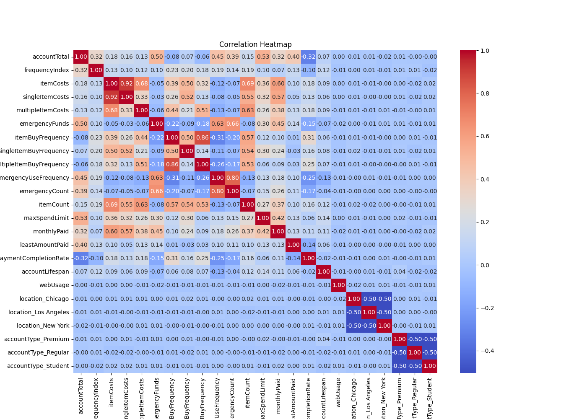
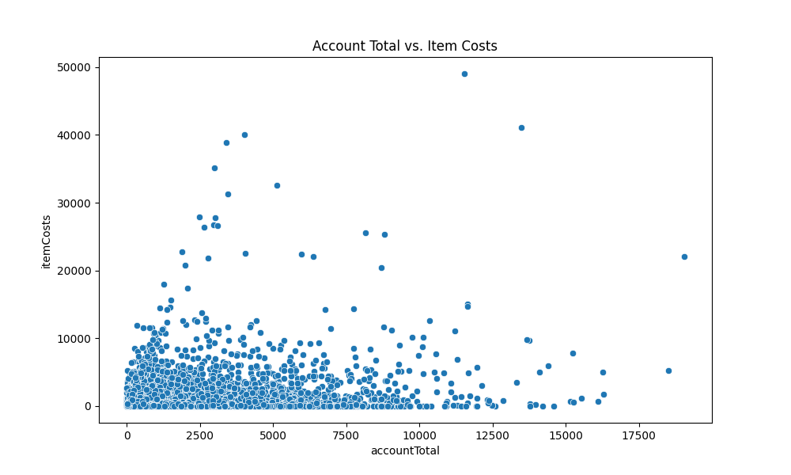
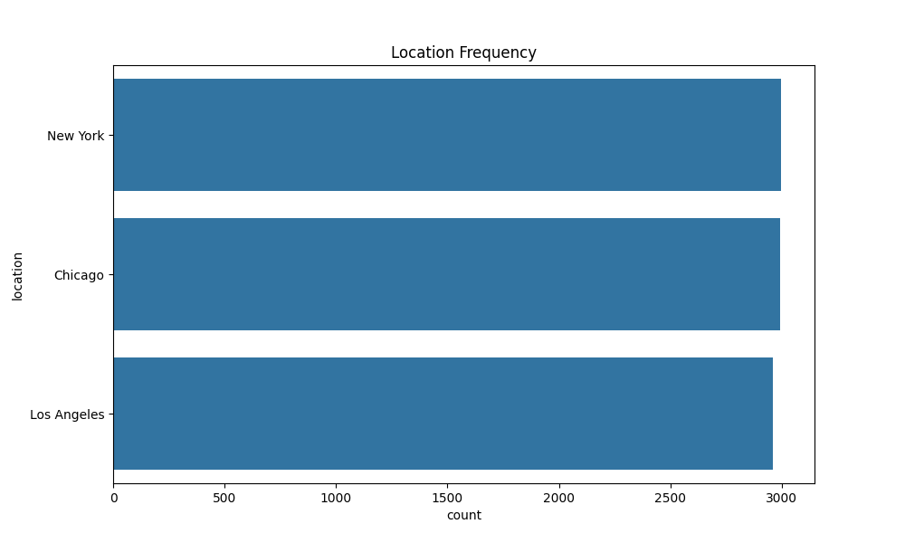
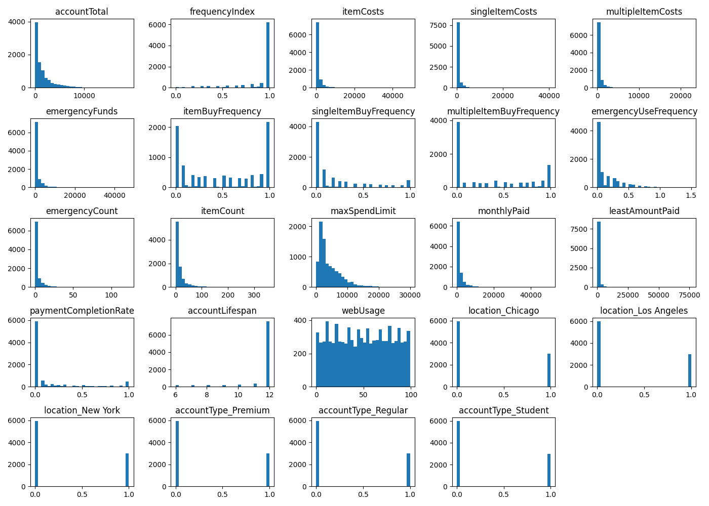
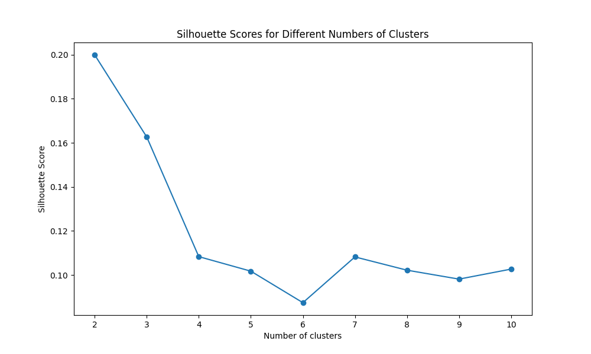
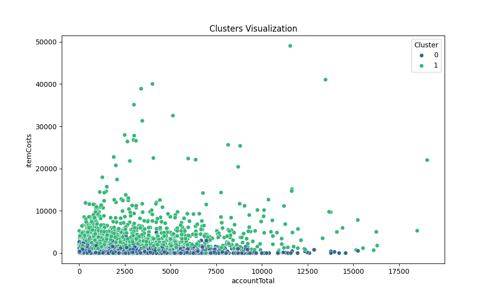

# AI-and-ML-Final-Project
Maratkyzy Zhanel (286251)
Issayeva Tomiris (289721)
Aruzhan Kenessova (286071)
George Maurice (E00308)

# ShopEasy Customer Segmentation Analysis

## 1) Introduction

ShopEasy is a leading e-commerce platform that aims to enhance user experiences through personalized services and promotions. This project focuses on understanding customer behavior by segmenting them into distinct groups based on their purchasing patterns. By applying clustering techniques, we aim to uncover hidden patterns and provide actionable insights for improving customer satisfaction and driving sales growth.

## 2) Methods

### Data Overview

The datasets utilized in our analysis consist of three primary files:

1.⁠ ⁠*⁠ recsys_customers.csv ⁠*: This dataset houses detailed information on 41,253 unique customers. For each customer, data is available concerning their age, as well as their membership status in the store’s club or subscription to the fashion newsletter, which indicates a level of engagement with the clothing shop.

2.⁠ ⁠*⁠ recsys_articles.csv ⁠*: Containing information on 6,536 articles, this dataset is rich with details on 21 distinct attributes for each article. These attributes cover aspects such as the article's type, color, and the specific group it belongs to, providing a comprehensive view of the product range available at the store.

3.⁠ ⁠*⁠ recsys_transactions.csv ⁠*: This dataset captures a substantial 369,113 transactions. Each record includes the date of the transaction, the customer who made the purchase, and the article that was bought, allowing for detailed tracking of sales and customer purchasing behavior.

These datasets collectively form a robust foundation for our analysis, enabling us to delve deep into customer demographics, product details, and buying patterns, which are crucial for developing effective recommender systems.

### Preparation of Data:
Data cleaning involved handling missing values and erroneous entries, particularly in the 'maxSpendLimit' and 'leastAmountPaid' fields. This was crucial as it ensured the integrity and reliability of our analysis.

 ### Exploratory Data Analysis and Data Visualization

Our EDA focused on uncovering underlying patterns and relationships within the data, employing statistical analysis and visualization tools. Key insights were drawn from the distribution of account totals, item costs, and customer engagement metrics using Python libraries such as Pandas, Matplotlib, and Seaborn.

### Section 3) Experimental Design
 
Clustering Techniques Used: K-Means Clustering:  Aimed to segment customers into distinct groups based on their spending behavior and account characteristics. We determined the optimal number of clusters using the Elbow Method and validated these segments with silhouette scores. Agglomerative Clustering:  Served as a hierarchical clustering approach to validate and refine the segments identified by k-means. This method provided a different perspective on the data's structure and helped in understanding the hierarchical relationships between customers. Utility of Segmentation: These techniques allowed us to categorize customers into segments that reflect varying levels of purchasing power and engagement, which can be targeted with tailored marketing strategies.

- 
#### Correlation Heatmap

Visualized the correlation between different features in the dataset.

#### Account Total vs. Item Costs

Visualized the relationship between the total account value and item costs.

#### Location Frequency

Visualized the distribution of users across different locations.

#### Feature Distributions

Visualized the distributions of various features in the dataset.

#### Silhouette Scores for Different Numbers of Clusters

Visualized the silhouette scores for different numbers of clusters.

#### Cluster Visualization

Visualized the clusters based on account total and item costs.

### KMeans Clustering

KMeans clustering was performed with the optimal number of clusters. Each customer was assigned to a cluster, and the characteristics of each cluster were analyzed.

### Cluster Descriptions

Clusters were described based on the mean values of features within each cluster. This provided insights into the characteristics of customers in each segment.

- **Cluster 0**: Customers with high account total and emergency funds, moderate item costs.
- **Cluster 1**: Customers with moderate account total and item costs, frequent single item purchases.
- **Cluster 2**: Customers with low account total, high frequency of emergency fund usage.

### Visualization of Clusters

Scatter plots were used to visualize the clusters, showing the distribution of customers across different spending patterns.

## 4) Results

### Summary of Findings

The clustering analysis revealed distinct customer segments with unique purchasing behaviors:
- **Cluster 0**: High spenders with significant emergency funds.
- **Cluster 1**: Moderate spenders with frequent single purchases.
- **Cluster 2**: Low spenders with high reliance on emergency funds.

## 5) Recommendations

- **Cluster 0**: Target these customers with premium services and high-value promotions.
- **Cluster 1**: Encourage bulk purchases with bundle offers.
- **Cluster 2**: Provide financial incentives and loyalty programs to increase spending.

## 6) Conclusion

The clustering analysis provided valuable insights into customer segments, enabling ShopEasy to tailor marketing strategies and enhance user experiences. By leveraging these insights, ShopEasy can improve customer satisfaction and drive sales growth.
