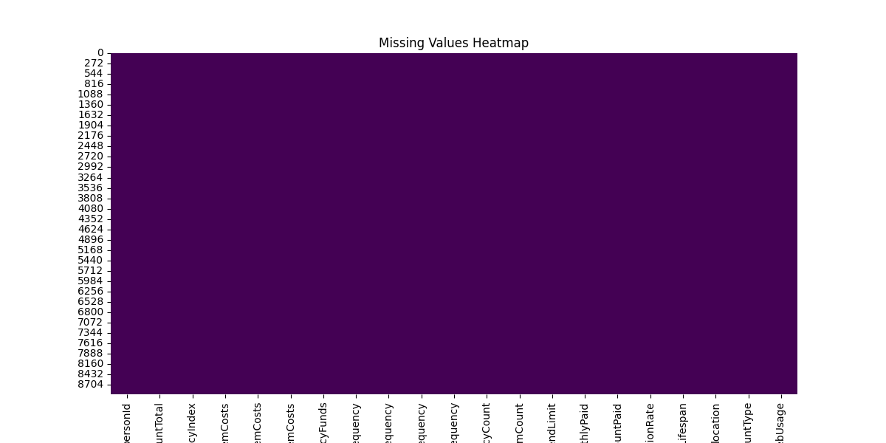

# AI-and-ML-Final-Project
Maratkyzy Zhanel (286251)
Issayeva Tomiris (289721)
Aruzhan Kenessova (286071)

# Introduction

ShopEasy is a leading e-commerce platform that aims to enhance user experiences through personalized services and promotions. This project focuses on understanding customer behavior by segmenting them into distinct groups based on their purchasing patterns. By applying clustering techniques, we aim to uncover hidden patterns and provide actionable insights for improving customer satisfaction and driving sales growth.

 ## Exploratory Data Analysis and Data Visualization

To gain a deeper understanding of the dataset, we performed exploratory data analysis (EDA) using data visualization and statistical analysis techniques. The main Python packages used for this analysis were:

- Numpy
- Pandas
- Seaborn
- Matplotlib

### Dataset Overview

The dataset contains the following features:

- **personId**: Unique identifier for each user on the platform
- **accountTotal**: Total amount spent by the user on ShopEasy since their registration
- **frequencyIndex**: Reflects how frequently the user shops, with 1 being very frequent and values less than 1 being less frequent
- **itemCosts**: Total costs of items purchased by the user
- **singleItemCosts**: Costs of items that the user bought in a single purchase without opting for installments
- **multipleItemCosts**: Costs of items that the user decided to buy in installments
- **emergencyFunds**: Amount that the user decided to keep as a backup in their ShopEasy wallet for faster checkout or emergency purchases
- **itemBuyFrequency**: Frequency with which the user makes purchases
- **singleItemBuyFrequency**: How often the user makes single purchases without opting for installments
- **multipleItemBuyFrequency**: How often the user opts for installment-based purchases
- **emergencyUseFrequency**: How frequently the user taps into their emergency funds
- **emergencyCount**: Number of times the user has used their emergency funds
- **itemCount**: Total number of individual items purchased by the user
- **maxSpendLimit**: The maximum amount the user can spend in a single purchase, set by ShopEasy based on user's buying behavior and loyalty
- **monthlyPaid**: Total amount paid by the user every month
- **leastAmountPaid**: The least amount paid by the user in a single transaction
- **paymentCompletionRate**: Percentage of purchases where the user has paid the full amount
- **accountLifespan**: Duration for which the user has been registered on ShopEasy
- **location**: User's city or region
- **accountType**: The type of account held by the user. Regular for most users, Premium for those who have subscribed to ShopEasy premium services, and Student for users who have registered with a student ID
- **webUsage**: A metric (0-100) indicating the frequency with which the user shops on ShopEasy via web browsers. A higher number indicates more frequent web usage

### Visualizations

#### Missing Values Heatmap

Visualized missing values to understand the extent of missing data.

#### Correlation Heatmap

Visualized the correlation between different features in the dataset.

#### Account Total vs. Item Costs

Visualized the relationship between the total account value and item costs.

#### Location Frequency

Visualized the distribution of users across different locations.

#### Feature Distributions

Visualized the distributions of various features in the dataset.

#### Silhouette Scores for Different Numbers of Clusters

Visualized the silhouette scores for different numbers of clusters.

#### Cluster Visualization

Visualized the clusters based on account total and item costs.

## Experimental Design

### Content-Based Recommender Systems

We built a recommender system to suggest new items to users based on their past purchases. The system recommends items that are similar to those the user has previously bought.

**Similarity Measurement**:
- Similarity is measured by comparing the attributes of items previously purchased by the user with other items.
- Cosine similarity is used to measure similarity. It calculates the dot product of the attribute vectors, measuring how similar the directions of the vectors are. A higher cosine similarity indicates more similar items.

**Attributes Used**:
- The attributes selected for the recommendation task include: `product_type`, `colour_group`, `section`, and `garment_group`.
- These attributes were chosen because they span a wide range of values and contribute different types of information.

**Implementation**:
- The dataset was prepared so that each row represents a different item and columns represent all possible values of the selected attributes. Each row contains binary features indicating the presence of each attribute value.
- A function was built to receive a customer ID and, based on all the purchases made by that customer, returns recommended items.

### Collaborative Recommender System

For collaborative filtering, we transformed the data into a utility matrix where rows represent customers and columns represent items.

**Utility Matrix**:
- Each entry in the matrix represents the interaction (e.g., purchase) between a customer and an item.
- We used the scipy.sparse.csr_matrix method from the sklearn library to generate the matrix.

**Sparsity Handling**:
- To ensure reliable data retrieval, we checked the sparsity of the matrix. Significant results are obtained if the sparsity is at least 0.5%. Since our matrix had a sparsity of 0.11%, we removed rows and columns with fewer than 20 non-zero values.

**Algorithm**:
- The k-NN algorithm was used to implement the collaborative filtering recommender system.

## Results

Manual testing of the outputs from different recommender systems demonstrated that we built effective tools to enhance the customization of offers for a retail platform. The collaborative recommender system, which takes a customer ID and returns various recommended items, was found to be the most precise. This system does not suffer from the data loss issues seen in the collaborative filtering approach due to matrix sparsity.

## Conclusions

During this project, we applied and practiced our knowledge of recommender systems. We successfully implemented both content-based and collaborative filtering recommenders. As future work, we suggest refining the software for greater precision and exploring other types of recommender systems. Overall, we are satisfied with the results, which have strengthened our skills and understanding of the subject matter.
