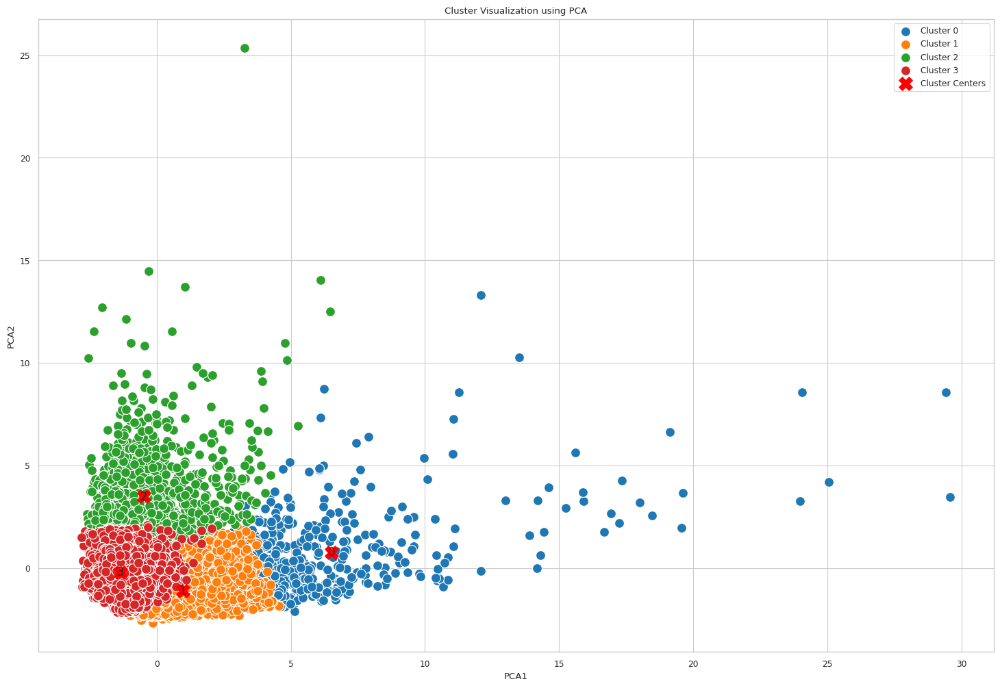
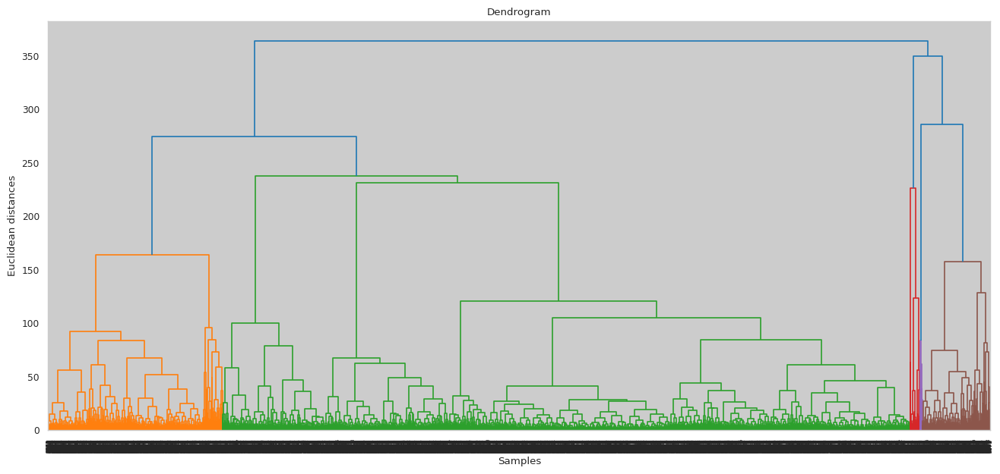
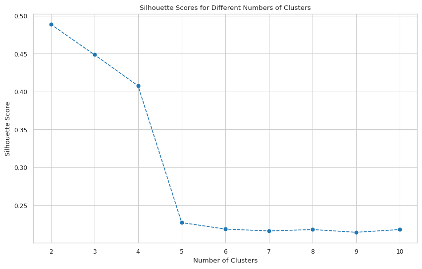
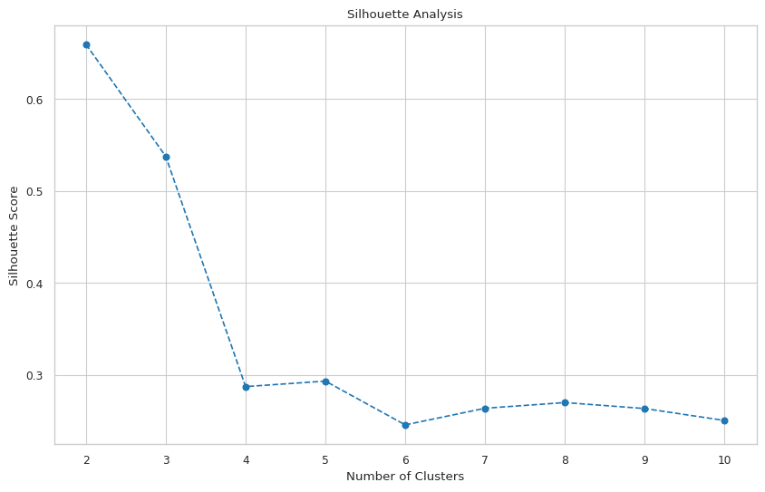
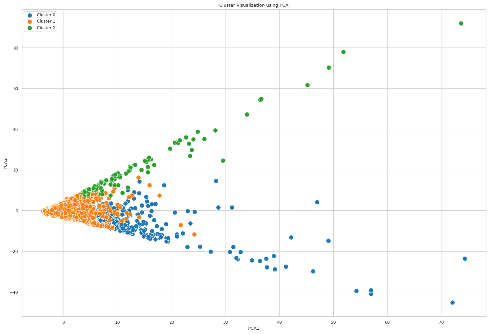
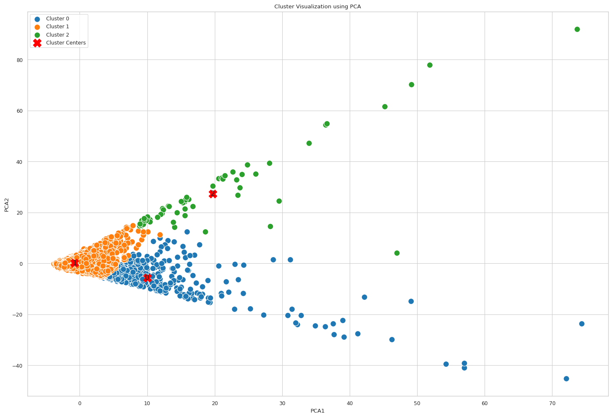

# AI and ML Final Project
- Issayeva Tomiris (289721)
- Maratkyzy Zhanel (286251)
- Aruzhan Kenessova (286071)
- George Maurice (E00308)

# ShopEasy Customer Segmentation Analysis

## 1) Introduction

ShopEasy is a leading e-commerce platform that aims to enhance user experiences through personalized services and promotions. This project focuses on understanding customer behavior by segmenting them into distinct groups based on their purchasing patterns. By applying clustering techniques, we aim to uncover hidden patterns and provide actionable insights for improving customer satisfaction and driving sales growth.

## 2) Methods

### Data Overview
The dataset utilized in our analysis consists of a single comprehensive file:

- **shopEasy.csv**: This dataset provides a detailed look at customer interactions and transactions on the ShopEasy platform. It encompasses a variety of information on 8,950 entries, giving us a deep dive into the purchasing patterns and behaviors of the customers. Here are the key components of this dataset:

  1. **Customer Details**: Each record includes the customer's identifier and demographic information like location and account type, which helps in understanding customer diversity and preferences.
  
  2. **Account Metrics**: Data such as account totals, emergency funds, and the maximum spend limit are available. These metrics help in assessing the financial engagement and capacity of the customers.
  
  3. **Transaction Details**: Detailed records of each transaction include the cost of items purchased, whether the purchases were single or multiple items, and the frequency of these transactions. This provides insights into the purchasing habits and preferences of the customers.
  
  4. **Engagement Metrics**: Information on the frequency of account usage, types of items bought, and customer loyalty indicators like subscription to newsletters or participation in the store’s club. These metrics are crucial for understanding customer loyalty and engagement levels.

This dataset forms a robust foundation for our analysis, enabling us to explore detailed customer demographics, financial behavior, and transactional data, which are crucial for developing effective segmentation and personalized marketing strategies.

### Preparation of Data:
Data cleaning involved handling missing values and erroneous entries, particularly in the 'maxSpendLimit' and 'leastAmountPaid' fields. This was crucial as it ensured the integrity and reliability of our analysis.

 ### Exploratory Data Analysis and Data Visualization

Our EDA focused on uncovering underlying patterns and relationships within the data, employing statistical analysis and visualization tools. Key insights were drawn from the distribution of account totals, item costs, and customer engagement metrics using Python libraries such as Pandas, Matplotlib, and Seaborn.

#### Data Visualisation

This histogram shows that most customers have low account balances, with the frequency decreasing as account values increase, indicating a right-skewed distribution.

#### Location Frequency

Visualized the distribution of users across different locations.

#### Feature Distributions

Visualized the distributions of various features in the dataset.

 This scatterplot with regression line shows the relationship between account total and item costs for ShopEasy customers, indicating a general trend where higher account totals do not necessarily correlate with higher item costs

  scatterplot with a regression line illustrates the relationship between account totals and emergency funds among ShopEasy customers, showing a moderate positive correlation where customers with higher account balances tend to have more in emergency funds.

  histogram displays the distribution of account totals for ShopEasy customers in Chicago (blue), Los Angeles (yellow), and New York (green), showing that lower account totals are more common across all locations, with a significant concentration in the lowest bin.

 correlation heatmap displays the relationships between various metrics within the ShopEasy dataset. Each cell color indicates the strength of correlation, with warmer colors (orange to yellow) showing higher positive correlations, and cooler colors (purple) indicating lower correlations. Notable strong correlations are seen between related purchasing behaviors such as item costs and single/multiple item buy frequencies.

### Implementing clustering
# K-Means clustering
# StandardScaler
We first used StandardScaler, not aware of its detriments. The resulting analysis was skewed by using StandardScaler, which wasn't suitable for our data. The data has a lot of outliers, and StandardScaler is not suitable for data with a lot of outliers and the results come out skewed. Therefore the first time the elbow method was indicative of using 4 clusters.

The results were not satisfactory, the silhouette score was only 0.1 which is very small. The cluster visualisation provided not clear picture of the clusters, overall bad quality of the clustering.The  plot utilizes the Elbow Method to optimize the number of clusters for K-means clustering. It graphs the cluster count against inertia (sum of squared distances of samples to their closest cluster center). The plot shows a discernible elbow at four clusters, suggesting that increasing the number of clusters beyond this point yields diminishing returns in terms of intra-cluster variance reduction. This method helps in selecting a cluster count that balances complexity and explanatory power of the clustering model.

# The  visualization employs Principal Component Analysis (PCA)
to reduce dimensionality for effective visualization of K-means clustering results. It plots the first two principal components, showing data points grouped into four distinct clusters, each color-coded. Cluster centers are marked with red 'X' symbols, illustrating the centroids of the respective clusters. This visualization aids in assessing the clustering algorithm's effectiveness by observing the spatial distribution and overlap between clusters.

 Elbow method to find the right number of clusters.
Iterate through 1-9 number of clusters and calculate the inertia for each number of clusters and plot it. The elbow point is where the inertia starts to decrease at a slower rate. The elbow point is not fully clear, but 3 is most likely it.

### Section 3) Experimental Design

### **Experiment 1: K-means StandardScaler vs RobustScaler**
- **The main purpose**: To assess the suitability of StandardScaler or RobustScaler for preprocessing data with outliers and its impact on clustering analysis.
- **Baselines**: Clustering segmentation analysis was used to compare. 
- **Evaluation metrics**: We used silhouette scores to compare the suitability of StandardScaler, and the resulting score was 0.1, which is very small and is unsatisfactory. We also visualised the resulting clusters and the clusters were not easily defined, showing poor clustering quality.
- In the result, we came to the conclusion to move to different feature scaling technique - RobustScaler. StandardScaler is poor at addresing outliers of the data, which our dataset had in abundance, which skewed the results and clustering.
- **Cluster visualisation of StandardScaler**: StandardScaler skewed the data, therefore elbow analysis showed that the optimal number of clusters is 4. This is the visualisation of 4 clusters using the data which was scaled using StandardScaler:

### **Experiment 2: Number of clusters**
- **The main purpose**: To determine the right number of clusters for clustering algorithms. 
- **Baselines**: We used elbow method, silhouette scores for k-means and dendrograms for hierarchical clustering. 
- **Evaluation metrics**: We used silhouette scores to determine the suitable number of clusters. In both cases, 2 was the most optimal number of clusters. However, 2 segments in the segment analysis would provide limited insight into the segments, therefore we chose 3 clusters as it had acceptably high silhouette scores and overall suitable for our analysis.
- Result: use 3 clusters.
Dendrogram and silhouette analysis for hierarchical clustering determination number of clusters:

Elbow method and silhouette analysis for k-means:

### **Experiment 3: K-means vs Hierarchical clustering**
- **The main purpose**: To assess whether to better use K-means or Hierarchical clustering for our model.
- **Baselines**: We implemented both K-means and Hierarchical clustering to compare their results. 
- **Evaluation metrics**: We used silhouette scores to compare the suitability of each clustering method. K-means had value of 0.537 vs Hierchical 0.448. The cluster visualisation also showed clearly that the K-means clusters had better separation than the Hierarchical clusters.
- Result: K-means is better suited than Hierarchical.
- Hierarchical cluster visualisation:

- K-means cluster visualisation:

 
## 4) Results

### Cluster Descriptions

### Cluster 0: High Spenders and Frequent Buyers

#### Defining Features:
- **High Account Total**: The average account total is 3118.14, which is quite high.
- **High Item Costs**: Total item costs are 6904.44, with single item costs at 4757.12.
- **High Multiple Item Costs**: 2148.47, the highest among the clusters.
- **High Emergency Funds**: Emergency funds are at 1250.94, indicating substantial savings for emergencies.
- **Frequent Item Purchases**: Item buy frequency is 0.92, with single item buy frequency at 0.73 and multiple item buy frequency at 0.72.
- **Moderate Emergency Use Frequency**: At 0.09, relatively low compared to Clusters 1 and 2.
- **High Payment Completion Rate**: At 0.32, significantly higher than the other clusters.
- **Distribution of Locations and Account Types**:
  - Locations: Chicago (35.40%), Los Angeles (31.33%), New York (33.27%).
  - Account Types: Premium (34.04%), Regular (29.98%), Student (35.98%).

#### Summary:
Cluster 0 represents high spenders and frequent buyers with high item costs, substantial emergency funds, and high payment completion rates. They are well-distributed across locations and tend to have a higher percentage of premium and student account types.

### Cluster 1: Low Spenders and Infrequent Buyers

#### Defining Features:
- **Low Account Total**: The average account total is 1447.01, the lowest among the clusters.
- **Low Item Costs**: Total item costs are 635.74, with single item costs at 337.18.
- **Low Multiple Item Costs**: 298.81, the lowest among the clusters.
- **Moderate Emergency Funds**: Emergency funds are at 959.10.
- **Infrequent Item Purchases**: Item buy frequency is 0.46, with single item buy frequency at 0.17 and multiple item buy frequency at 0.34.
- **Highest Emergency Use Frequency**: At 0.14, the highest among the clusters.
- **Low Payment Completion Rate**: At 0.14, lower than Cluster 0 but higher than Cluster 2.
- **Distribution of Locations and Account Types**:
  - Locations: Chicago (33.33%), Los Angeles (33.19%), New York (33.48%).
  - Account Types: Premium (33.50%), Regular (33.68%), Student (32.82%).

#### Summary:
Cluster 1 represents low spenders and infrequent buyers with low item costs, moderate emergency funds, and the highest emergency use frequency. This cluster is evenly distributed across locations and account types.

### Cluster 2: High Account Total with Very Low Payment Completion

#### Defining Features:
- **Highest Account Total**: The average account total is 4569.73, the highest among the clusters.
- **Moderate Item Costs**: Total item costs are 1434.47, with single item costs at 328.03.
- **Moderate Multiple Item Costs**: 1106.43, moderate compared to the other clusters.
- **High Emergency Funds**: Emergency funds are at 1393.10, the highest among the clusters.
- **Moderate Item Purchases**: Item buy frequency is 0.50, with single item buy frequency at 0.07 and multiple item buy frequency at 0.46.
- **High Emergency Use Frequency**: At 0.13, slightly lower than Cluster 1.
- **Very Low Payment Completion Rate**: At 0.003, significantly lower than the other clusters.
- **Distribution of Locations and Account Types**:
  - Locations: Chicago (30.00%), Los Angeles (33.33%), New York (36.67%).
  - Account Types: Premium (31.67%), Regular (33.33%), Student (35.00%).

#### Summary:
Cluster 2 represents users with the highest account totals and emergency funds but moderate item costs and very low payment completion rates. This cluster has a higher representation from New York and a balanced distribution across premium, regular, and student account types.

### Differences and Insights:

- **Cluster 0**: High spenders and frequent buyers with high item costs and substantial emergency funds. They have high payment completion rates and are well-distributed across account types, particularly premium and student accounts.
- **Cluster 1**: Low spenders and infrequent buyers with low item costs and moderate emergency funds. They have the highest emergency use frequency and a balanced distribution across locations and account types.
- **Cluster 2**: Users with the highest account totals and emergency funds but moderate item costs and very low payment completion rates. This cluster has a higher representation from New York and a significant proportion of student accounts.

### Visualization of Clusters

Scatter plots were used to visualize the clusters, showing the distribution of customers across different spending patterns.
- K-means cluster visualisation:

## Recommendations

### Cluster 0: High Spenders and Frequent Buyers

#### Characteristics:
- High account totals and item costs.
- Frequent purchases, both single and multiple items.
- Moderate emergency fund use and low emergency use frequency.
- Higher payment completion rate.

#### Insights and Usefulness:
1. **Loyalty Programs**: These customers are likely loyal and high-value, so investing in loyalty programs, exclusive deals, and personalized recommendations can further enhance their engagement.
2. **Premium Services**: Offer premium services or memberships with additional perks, as they are more likely to invest in higher-end products and services.
3. **Targeted Marketing**: Tailor marketing campaigns with a focus on high-value items and premium product lines to appeal to their purchasing behavior.

### Cluster 1: Low Spenders and Infrequent Buyers

#### Characteristics:
- Low account totals and item costs.
- Infrequent purchases with higher emergency fund use and the highest emergency use frequency.
- Balanced distribution across locations and account types.

#### Insights and Usefulness:
1. **Promotional Campaigns**: Design targeted promotions, discounts, and deals to encourage more frequent purchases and increase their overall spending.
2. **Budget-Friendly Options**: Highlight budget-friendly options, payment plans, and small-ticket items to match their spending habits.
3. **Engagement Strategies**: Implement engagement strategies such as email reminders, personalized recommendations, and loyalty rewards for incremental spending.

### Cluster 2: Moderate Spenders with High Emergency Fund Use

#### Characteristics:
- Moderate account totals and item costs.
- Infrequent purchases but high emergency fund use.
- Very low payment completion rate.
- More likely to be from New York and have premium accounts.

#### Insights and Usefulness:
1. **Payment Flexibility**: Introduce flexible payment options, installment plans, or delayed payment schemes to help improve their payment completion rates.
2. **Financial Assistance Programs**: Develop financial assistance programs or targeted offers to help these customers manage their finances better and encourage more consistent spending.
3. **Retention Strategies**: Focus on retention strategies for premium account holders with personalized support, financial advice, and exclusive content to increase their satisfaction and reduce churn.

## 5) Conclusion

The clustering analysis provided valuable insights into customer segments, enabling ShopEasy to tailor marketing strategies and enhance user experiences. By leveraging these insights, ShopEasy can improve customer satisfaction and drive sales growth.
