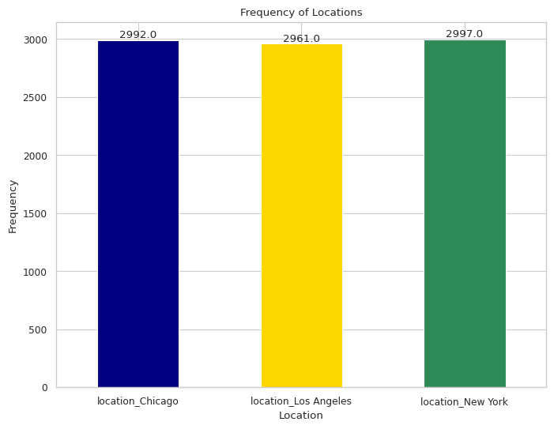

# AI and ML Final Project
- Issayeva Tomiris (289721)
- Maratkyzy Zhanel (286251)
- Aruzhan Kenessova (286071)
- George Maurice (E00308)

# ShopEasy Customer Segmentation Analysis

## 1) Introduction

ShopEasy is a leading e-commerce platform that aims to enhance user experiences through personalized services and promotions. This project focuses on understanding customer behavior by segmenting them into distinct groups based on their purchasing patterns. By applying clustering techniques, we aim to uncover hidden patterns and provide actionable insights for improving customer satisfaction and driving sales growth.

## 2) Methods

### Data Overview
The dataset utilized in our analysis consists of a single comprehensive file:

- **shopEasy.csv**: This dataset provides a detailed look at customer interactions and transactions on the ShopEasy platform. It encompasses a variety of information on 8,950 entries, giving us a deep dive into the purchasing patterns and behaviors of the customers. Here are the key components of this dataset:

  1. **Customer Details**: Each record includes the customer's identifier and demographic information like location and account type, which helps in understanding customer diversity and preferences.
  
  2. **Account Metrics**: Data such as account totals, emergency funds, and the maximum spend limit are available. These metrics help in assessing the financial engagement and capacity of the customers.
  
  3. **Transaction Details**: Detailed records of each transaction include the cost of items purchased, whether the purchases were single or multiple items, and the frequency of these transactions. This provides insights into the purchasing habits and preferences of the customers.
  
  4. **Engagement Metrics**: Information on the frequency of account usage, types of items bought, and customer loyalty indicators like subscription to newsletters or participation in the store’s club. These metrics are crucial for understanding customer loyalty and engagement levels.

This dataset forms a robust foundation for our analysis, enabling us to explore detailed customer demographics, financial behavior, and transactional data, which are crucial for developing effective segmentation and personalized marketing strategies.

### Preparation of Data:
Data cleaning involved handling missing values and erroneous entries, particularly in the 'maxSpendLimit' and 'leastAmountPaid' fields. This was crucial as it ensured the integrity and reliability of our analysis.

 ### Exploratory Data Analysis and Data Visualization

Our EDA focused on uncovering underlying patterns and relationships within the data, employing statistical analysis and visualization tools. Key insights were drawn from the distribution of account totals, item costs, and customer engagement metrics using Python libraries such as Pandas, Matplotlib, and Seaborn.

#### Correlation Heatmap

Visualized the correlation between different features in the dataset.

#### Account Total vs. Item Costs

Visualized the relationship between the total account value and item costs.

#### Location Frequency

Visualized the distribution of users across different locations.

#### Feature Distributions

Visualized the distributions of various features in the dataset.

#### Silhouette Scores for Different Numbers of Clusters

Visualized the silhouette scores for different numbers of clusters.

#### Cluster Visualization

Visualized the clusters based on account total and item costs.

### Section 3) Experimental Design

**Experiment 1: K-means StandardScaler vs RobustScaler**
- **The main purpose**: To assess the suitability of StandardScaler or RobustScaler for preprocessing data with outliers and its impact on clustering analysis.
- **Baselines**: Clustering segmentation analysis was used to compare. 
- **Evaluation metrics**: We used silhouette scores to compare the suitability of StandardScaler, and the resulting score was 0.1, which is very small and is unsatisfactory. We also visualised the resulting clusters and the clusters were not easily defined, showing poor clustering quality.
- In the result, we came to the conclusion to move to different feature scaling technique - RobustScaler. StandardScaler is poor at addresing outliers of the data, which our dataset had in abundance, which skewed the results and clustering.

**Experiment 2: Number of clusters**
- **The main purpose**: To determine the right number of clusters for 
- **Baselines**: We used elbow method, silhouette scores, dendrograms. 
- **Evaluation metrics**:

**Experiment 3: K-means vs Hierarchical clustering**
- **The main purpose**: To assess the suitability of K-means or Hierarchical clustering for our model.
- **Baselines**
- **Evaluation metrics**: We used silhouette scores.
 

## 4) Results

### Cluster Descriptions

Clusters were described based on the mean values of features within each cluster. This provided insights into the characteristics of customers in each segment.

- **Cluster 0**: Customers with high account total and emergency funds, moderate item costs.
- **Cluster 1**: Customers with moderate account total and item costs, frequent single item purchases.
- **Cluster 2**: Customers with low account total, high frequency of emergency fund usage.

### Visualization of Clusters

Scatter plots were used to visualize the clusters, showing the distribution of customers across different spending patterns.

### Summary of Findings

The clustering analysis revealed distinct customer segments with unique purchasing behaviors:
- **Cluster 0**: High spenders with significant emergency funds.
- **Cluster 1**: Moderate spenders with frequent single purchases.
- **Cluster 2**: Low spenders with high reliance on emergency funds.

## 5) Recommendations

- **Cluster 0**: Target these customers with premium services and high-value promotions.
- **Cluster 1**: Encourage bulk purchases with bundle offers.
- **Cluster 2**: Provide financial incentives and loyalty programs to increase spending.

## 6) Conclusion

The clustering analysis provided valuable insights into customer segments, enabling ShopEasy to tailor marketing strategies and enhance user experiences. By leveraging these insights, ShopEasy can improve customer satisfaction and drive sales growth.
